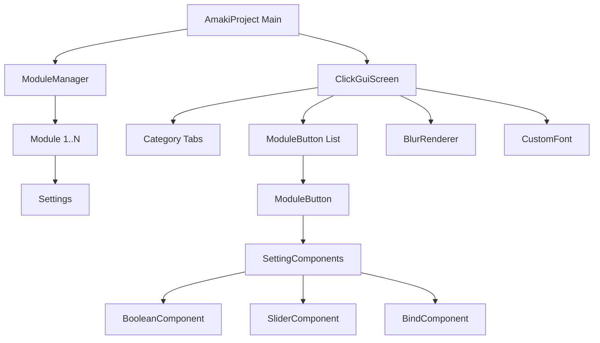

# Архитектура AmakiProject

## 📐 Обзор

AmakiProject построен на модульной архитектуре с четким разделением ответственности между компонентами.



## 🏗️ Компоненты

### 1. Core (`com.amaki`)

#### `AmakiProject.java`
- **Роль:** Главный entry point мода
- **Ответственность:**
  - Инициализация мода при загрузке клиента
  - Регистрация кейбиндов (Right Shift для открытия GUI)
  - Управление жизненным циклом ModuleManager
  - Обработка клиентских тиков

```java
@Override
public void onInitializeClient() {
    instance = this;
    moduleManager = ModuleManager.getInstance();
    registerKeybindings();
    registerTickHandler();
}
```

### 2. Module System (`com.amaki.module`)

#### `Module.java`
- **Базовый класс** для всех модулей
- **Содержит:**
  - Имя, описание, категория
  - Состояние вкл/выкл
  - Список настроек (`Setting<?>`)
  - Методы `onEnable()`, `onDisable()`

#### `ModuleManager.java`
- **Singleton** менеджер всех модулей
- **Функции:**
  - Инициализация модулей при старте
  - Получение модулей по категории
  - Поиск модулей по имени

```java
// Пример использования
List<Module> combatModules = ModuleManager.getInstance()
    .getModulesByCategory(Category.COMBAT);
```

### 3. Settings System (`com.amaki.module.setting`)

Иерархия настроек:

```
Setting<T> (abstract)
├── BooleanSetting (вкл/выкл)
├── DoubleSetting (slider с min/max)
└── KeybindSetting (код клавиши GLFW)
```

#### `BooleanSetting`
```java
public class BooleanSetting extends Setting<Boolean> {
    public void toggle();
    public boolean isEnabled();
}
```

#### `DoubleSetting`
```java
public class DoubleSetting extends Setting<Double> {
    private double min, max, increment;
    
    public double getPercentage();      // 0.0 - 1.0
    public void setPercentage(double);  // Для слайдера
}
```

#### `KeybindSetting`
```java
public class KeybindSetting extends Setting<Integer> {
    public String getKeyName();  // "SPACE", "RSHIFT" и т.д.
}
```

### 4. GUI System (`com.amaki.gui`)

#### `ClickGuiScreen.java`
- **Главный экран** ClickGUI
- **Структура:**
  ```
  ┌─────────────────────────────────┐
  │ [A] Combat✗ Player○ Movement➜  │ ← Tab Bar
  ├─────────────────────────────────┤
  │ ▶ KillAura              ✓       │ ← Module Button
  │   ├ Players             ☑       │ ← Boolean Setting
  │   ├ Range               ━━━ 3.5 │ ← Slider Setting
  │   └ Bind                R       │ ← Keybind Setting
  │ ▶ Velocity              ○       │
  └─────────────────────────────────┘
  ```

- **Рендеринг:**
  1. `BlurRenderer.renderBlurredBackground()` - размытый фон
  2. `renderWindow()` - темное окно GUI
  3. `renderTabBar()` - верхняя панель категорий
  4. `renderModuleList()` - список модулей с настройками

- **Анимации:**
  - Fade alpha: 0→1 при открытии
  - Smooth scrolling: плавная прокрутка списка
  - Expand progress: раскрытие настроек модуля

#### `Category.java` (enum)
```java
public enum Category {
    COMBAT("Combat", "⚔"),
    PLAYER("Player", "◉"),
    MOVEMENT("Movement", "➜"),
    VISUALS("Visuals", "○"),
    MISC("Misc", "×");
}
```

#### `ModuleButton.java`
- **Представление** одного модуля в GUI
- **Функции:**
  - Рендер кнопки модуля (28px высота)
  - Рендер списка настроек (с отступом 10px)
  - Анимация раскрытия (`expandProgress`)
  - Обработка кликов (ЛКМ toggle, ПКМ expand)

### 5. Setting Components (`com.amaki.gui.components`)

#### `SettingComponent<T>` (abstract)
- **Базовый класс** для визуальных компонентов настроек
- **Методы:**
  - `render()` - отрисовка
  - `mouseClicked()` - обработка клика
  - `mouseReleased()` - отпускание мыши
  - `mouseMoved()` - перемещение (для drag)

#### `BooleanComponent`
```
┌──────────────────────────┐
│ Players          [✓]     │ ← 12x12 белый квадрат
└──────────────────────────┘
```

#### `SliderComponent`
```
┌──────────────────────────┐
│ Range               3.5  │ ← Значение
│ ━━━━━━━━━━━━━━░░░░░░░░  │ ← Слайдер (fill + bg)
└──────────────────────────┘
```

#### `BindComponent`
```
┌──────────────────────────┐
│ Keybind             R    │ ← Название клавиши
└──────────────────────────┘
```

### 6. Rendering (`com.amaki.gui.render`)

#### `CustomFont.java`
- **Wrapper** для кастомного TTF шрифта
- **Функции:**
  - `drawString()` - рисовать текст без тени
  - `drawCenteredString()` - центрированный текст
  - `getStringWidth()` - ширина строки

```java
CustomFont font = CustomFont.getInstance();
font.drawString(context, "Text", x, y, 0xFFFFFFFF);
```

#### `BlurRenderer.java`
- **Эффект размытия** фона
- **Реализация:**
  ```java
  // 1. Темный полупрозрачный оверлей (alpha ~56%)
  renderDarkOverlay(matrix);
  
  // 2. В продакшене: shader-based Gaussian blur
  // applyGaussianBlur(framebuffer, radius);
  ```

## 🎨 Цветовая палитра

```java
// Константы из кода
COLOR_WINDOW_BG      = 0xEE0D0D0D  // Фон окна (~93% opacity)
COLOR_TAB_BAR        = 0xFF111111  // Панель вкладок
COLOR_TAB_ACTIVE     = 0x1FFFFFFF  // Активная вкладка (~12% white)
COLOR_TAB_INACTIVE   = 0xFF222222  // Неактивная вкладка

COLOR_BG             = 0xFF111111  // Фон модуля
COLOR_BG_HOVER       = 0xFF1E1E1E  // Hover эффект
COLOR_BG_ENABLED     = 0xFF1A2A1A  // Включенный модуль (темно-зеленый)

COLOR_TEXT           = 0xFFE0E0E0  // Основной текст
COLOR_TEXT_DIM       = 0xFFAAAAAA  // Тусклый текст

COLOR_SLIDER_BG      = 0xFF333333  // Фон слайдера
COLOR_SLIDER_FILL    = 0xFFAAAAAA  // Заполнение слайдера
```

## 🔄 Поток данных

### Открытие GUI
```
User Press [Right Shift]
    ↓
ClientTickEvents.END_CLIENT_TICK
    ↓
AmakiProject.openClickGui()
    ↓
MinecraftClient.setScreen(new ClickGuiScreen())
    ↓
ClickGuiScreen.init()
    ↓
loadCategory(COMBAT)
    ↓
ModuleManager.getModulesByCategory()
    ↓
Create ModuleButton for each Module
```

### Клик на модуль
```
User Click [Module Button]
    ↓
ClickGuiScreen.mouseClicked()
    ↓
ModuleButton.mouseClicked()
    ↓
[Left Click]  → Module.toggle() → onEnable()/onDisable()
[Right Click] → expanded = !expanded
```

### Изменение настройки
```
User Drag [Slider]
    ↓
SliderComponent.mouseMoved()
    ↓
updateValue(mouseX)
    ↓
DoubleSetting.setPercentage()
    ↓
DoubleSetting.setValue()
```

## 🎯 Преимущества архитектуры

### 1. Модульность
- Каждый компонент независим
- Легко добавлять новые модули/настройки
- Переиспользуемость кода

### 2. Расширяемость
```java
// Добавить новый тип настройки:
public class ColorSetting extends Setting<Integer> { ... }

// Добавить новый компонент:
public class ColorComponent extends SettingComponent<ColorSetting> { ... }

// Зарегистрировать в ModuleButton:
else if (setting instanceof ColorSetting colorSetting) {
    settingComponents.add(new ColorComponent(colorSetting));
}
```

### 3. Производительность
- Lazy initialization (ModuleManager singleton)
- Efficient rendering (scissor test для скроллинга)
- Smooth animations (delta-based interpolation)

### 4. Maintainability
- Четкое разделение логики и рендеринга
- Понятная иерархия классов
- Подробные комментарии на русском языке

## 🔮 Возможные улучшения

### 1. Shader-based Blur
```java
// Использовать Minecraft shader для настоящего Gaussian blur
ShaderEffect blurShader = new ShaderEffect(...);
blurShader.addPass("blur_horizontal", ...);
blurShader.addPass("blur_vertical", ...);
```

### 2. Config система
```java
// Сохранение/загрузка настроек в JSON
public class ConfigManager {
    public void save();
    public void load();
}
```

### 3. Theme система
```java
// Кастомные темы GUI
public class Theme {
    public int getBackgroundColor();
    public int getAccentColor();
    // ...
}
```

### 4. Search функция
```java
// Поиск модулей в GUI
public void searchModules(String query) {
    // Фильтрация и подсветка результатов
}
```

---

**Документация актуальна для версии 1.0.0**
